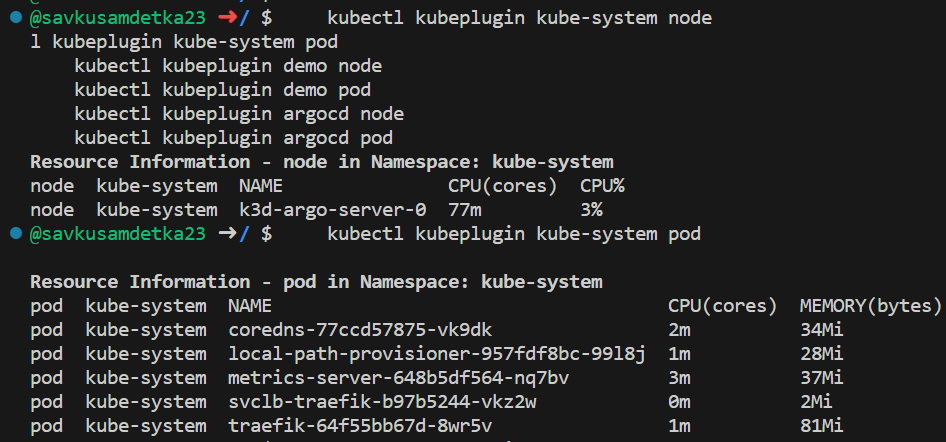
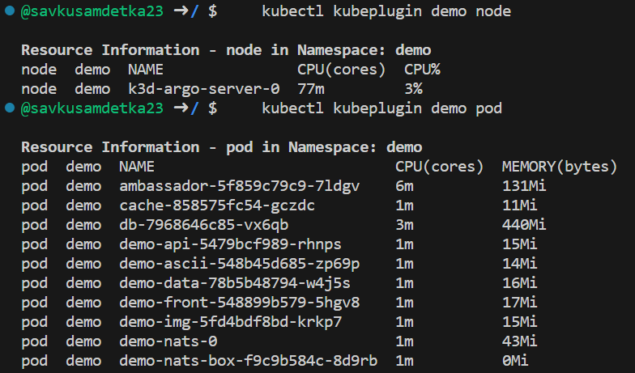
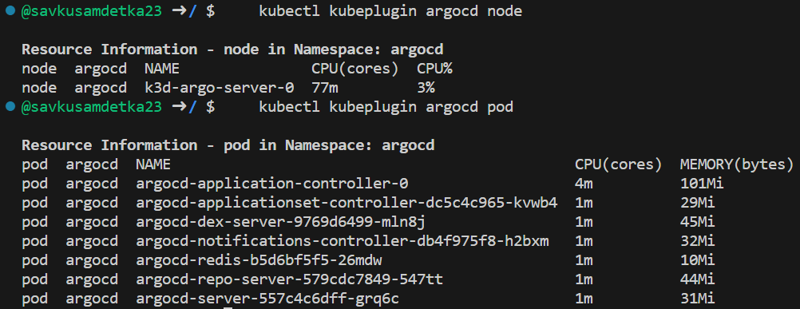

# Plugin installation
## Install script as kubectl plugin
You can use "kubeplugin.sh" file from the scripts folder in current repository.
    # Check kist of available kubectl plugins
    kubectl plugin list

    # Copy your plugin script to the folder with kubectl plugins 
    sudo chmod +x ./kubeplugin.sh
    sudo cp kubeplugin.sh /usr/local/bin/kubectl-kubeplugin
    sudo chmod +x usr/local/bin/kubectl-kubeplugin

    # Check kist of available kubectl plugins
    kubectl plugin list

    # Use plugin
    kubectl kubeplugin

## Plugin usage

Examples of using as kubectl plugin
To show nodes or pods information, just provide Namespace name and Resource type: 
`kubectl kubeplugin <namespace> <resource>`

    kubectl kubeplugin kube-system node
    kubectl kubeplugin kube-system pod

    
    kubectl kubeplugin demo node
    kubectl kubeplugin demo pod

    kubectl kubeplugin argocd node
    kubectl kubeplugin argocd pod

    
## Testing plugin as script 

Examples of using script locally
To show nodes or pods information, just provide Namespace name and Resource type: 
`bash script/kubeplugin.sh <namespace> <resource>`

    bash script/kubeplugin.sh kube-system node
    bash script/kubeplugin.sh kube-system pod
    bash script/kubeplugin.sh demo node
    bash script/kubeplugin.sh demo pod
    bash script/kubeplugin.sh argocd node
    bash script/kubeplugin.sh argocd pod
